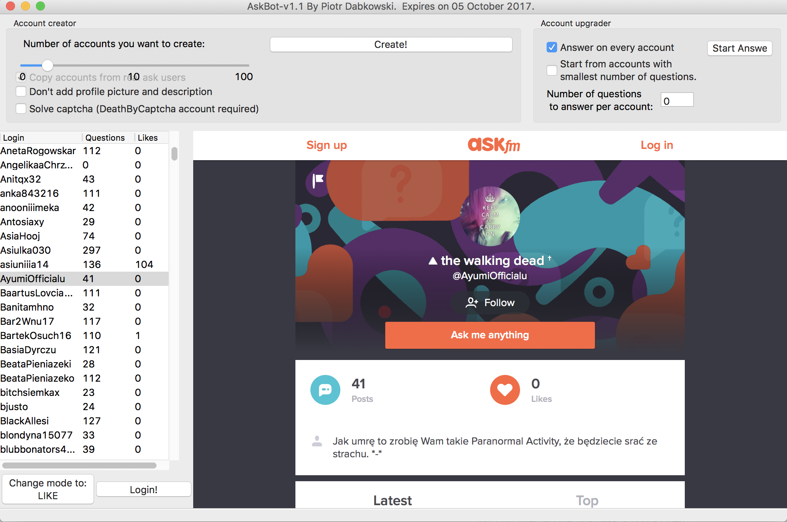

## ask.fm bot (no longer works, outdated code)

An advanced bot for ask.fm that supports very fast liking (up to 50 likes per second).

Supported features:
* **Automated account creation**  - bypasses captcha and generates a fake profile that looks pretty real (for example the account seen in the screenshot below was generated fully automatically).
* **Automated question answering** - in order for fake accounts to look real they should have some questions answered, the bot does that for you and supports answering in English and Polish.
* **Fast Liking** - Uses automatically created accounts to add likes to the specified target. Uses proxies to support high liking rates. I was able to successfully add half a million of likes using this program.

To use:

    pip install -r requirements.txt
    python GUI.py

(looks better on Windows)